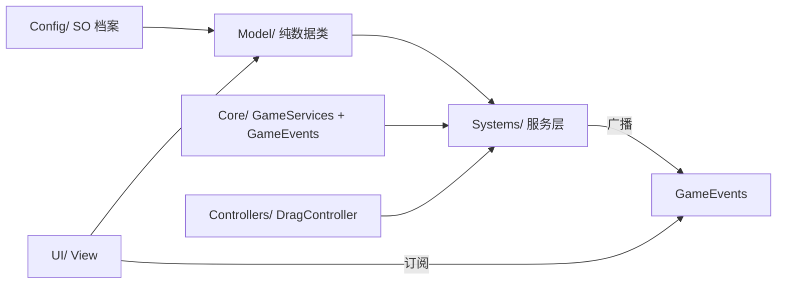

# 《生存档铺》代码架构设计

> 状态：已定稿（第一版）
> 日期：2026-09-20
> 依据：`策划文档.md` 第七章「数据架构」的改良 MVC，结合当前项目现状（`InventoryConfig` + `InventoryGridUI` + `Slot` 已打通 24×10 网格生成）落地为可执行的目录与依赖规范。

---

## 一、设计决策（已拍板）

| 决策点 | 选择 | 理由 |
|--------|------|------|
| 格子库存抽象 | **统一 `GridInventory` 数据模型** | 仓库(24×10)、交易台(2×6)、客户窗口(2×6) 本质是同一结构，放置/旋转算法只写一份 |
| 架构风格 | **分层 MVC + 轻量服务定位器** | Unity 生态最主流，单人项目易懂、易调试 |
| 依赖管理 | **`GameServices` 静态服务定位器** | 替代分散的 MonoBehaviour 单例；不引入 VContainer/Zenject 等重型 DI |
| 事件通信 | **静态 `GameEvents` 事件中心** | 只用于跨模块广播；模块内部直接调用，避免事件满天飞 |
| 配置数据 | **ScriptableObject（静态档案）** | 与现有 `InventoryConfig` 风格一致，策划可编辑、可引用 icon/prefab |
| 运行时数据 | **纯 C# 类（无 MonoBehaviour）** | `ItemInstance`/`Customer`/`DailyReport` 可脱离 Unity 单测 |

---

## 二、命名空间总览

| 命名空间 | 含义 | 对应层 |
|---------|------|--------|
| `SurvivalPawnShop.Core` | 基础设施（服务定位器、事件中心） | 横切 |
| `SurvivalPawnShop.Config` | ScriptableObject 静态档案 | 配置 |
| `SurvivalPawnShop.Model` | 纯 C# 数据类（无 MonoBehaviour） | Model |
| `SurvivalPawnShop.Systems` | 系统服务（游戏逻辑） | Controller 上移一层 |
| `SurvivalPawnShop.UI` | 表现层 MonoBehaviour | View |
| `SurvivalPawnShop.Controllers` | 输入/拖拽交互 | Controller |
| `SurvivalPawnShop.Utils` | 工具（坐标换算等） | 横切 |

---

## 三、目录结构（文件位置）

```
Assets/_Project/Scripts/
├── Core/
│   ├── GameServices.cs          # 轻量服务定位器（静态注册表）
│   └── GameEvents.cs            # 静态事件中心（跨模块广播）
│
├── Config/
│   ├── InventoryConfig.cs       # 【现有·保留】网格布局 SO
│   ├── ItemConfigSO.cs          # 物品静态档案 SO
│   ├── CustomerConfigSO.cs      # 顾客类型档案 SO（后续）
│   └── EventConfigSO.cs         # 报纸波动事件档案 SO（后续）
│
├── Model/
│   ├── GridInventory.cs         # ★统一格子库存模型（地基）
│   ├── ItemInstance.cs          # 运行时物品数据
│   ├── Customer.cs              # 顾客运行时数据（后续）
│   ├── PlayerData.cs            # 玩家数据（后续）
│   └── DailyReport.cs           # 当日结算日报（后续）
│
├── Systems/
│   ├── InventorySystem.cs       # 仓库服务（持有主 GridInventory）（后续）
│   ├── TradeSystem.cs           # 交易台 + 客户窗口服务（后续）
│   ├── EconomySystem.cs         # 金钱 + 价格波动（后续）
│   ├── TimeSystem.cs            # 天/周循环状态机（后续）
│   ├── CustomerSystem.cs        # 顾客生成 + 买卖流程（后续）
│   └── EventSystem.cs           # 报纸/小偷事件（后续）
│
├── Controllers/
│   └── DragController.cs        # 拖拽、旋转、坐标换算（后续）
│
├── UI/
│   ├── InventoryGridUI.cs       # 【已迁移】网格生成
│   ├── InventorySlot.cs         # 【已迁移+改名，原 Slot.cs】
│   ├── ItemView.cs              # 物品视觉（后续）
│   └── HighlightView.cs         # 拖拽绿/红高亮（后续）
│
└── Utils/
    └── GridMath.cs              # 屏幕↔网格坐标换算
```

> ✅ 迁移已完成：原 `Scripts/Inventory/` 目录中的 `InventoryGridUI.cs`、`Slot.cs` 已迁移到 `UI/`，`Slot.cs` 改名 `InventorySlot.cs`。`.meta` 文件随脚本同步迁移，且 GUID 已修复为场景/预制体引用处的稳定值（`InventoryGridUI` → `1d14acf54acebe64395d4c3c85e2d8e0`、`InventorySlot` → `1bb8bb0f3d1d27943a1d517acec0286f`），`ItemSlot.prefab` 与 `Test.unity` 中的引用不再断裂。

---

## 四、核心类职责

### 4.1 `Core/GameServices.cs`（服务定位器）

```csharp
public static class GameServices {
    public static void Register<T>(T service);   // 注册
    public static T Get<T>();                     // 获取，未注册抛错
    public static bool TryGet<T>(out T service);
    public static void Clear();                   // 场景重载时清空
}
```

**规则**：所有 System 在 `Awake` 里 `Register`，其它模块通过 `Get<T>()` 拿，**禁止分散的 MonoBehaviour 单例**。

### 4.2 `Core/GameEvents.cs`（事件中心）

| 事件 | 参数 | 触发时机 |
|------|------|----------|
| `OnMoneyChanged` | `int 新余额` | 余额变动 |
| `OnInventoryChanged` | 无 | 仓库增删物品 |
| `OnTradeCompleted` | 无 | 一笔交易完成 |
| `OnDayEnd` | 无 | 日报弹出 |
| `OnWeekStart` | 无 | 报童上门 / 行情刷新 |

### 4.3 `Model/GridInventory.cs`（★核心地基）

```csharp
public class GridInventory {
    public int Columns { get; }
    public int Rows { get; }
    public bool CanPlace(ItemConfigSO config, Vector2Int anchor, bool rotated);
    public bool TryPlace(ItemInstance item, Vector2Int anchor, bool rotated);
    public ItemInstance Remove(Vector2Int origin);
    public ItemInstance FindItemAt(Vector2Int cell);   // 任意格查询（含非锚点）
    public bool IsCellOccupied(Vector2Int cell);
    public IEnumerable<ItemInstance> AllItems { get; }
}
```

**这是全游戏唯一一套放置/旋转/占用算法**。仓库、交易台、客户窗口都 `new GridInventory(...)`，绝不重复写。

### 4.4 其余

- `ItemConfigSO`：`itemID / itemName / icon / category / sellPrice / shapeOffsets`；`WholesalePrice => sellPrice × 0.8` 自动计算。
- `ItemInstance`：`config / gridPos / isRotated`，运行时数据。
- `GridMath`：`WorldToGrid` / `GridToWorld` 屏幕↔网格坐标换算（左上原点，Y 向下）。

---

## 五、依赖流（单向，禁止反向）



**铁律**：

1. `Model` 除 `UnityEngine` 基础类型（`Vector2Int` 等）外不引用任何游戏模块，可脱离 Unity 单测。
2. `Config` 只被 `Model`/`Systems` 读，不反向引用。
3. `UI` 读 `Model`、订阅 `Events`，但**只通过 `Systems` 改数据**。
4. `Core` 被所有人引用，不引用任何人。

---

## 六、现有文件迁移映射

| 现在 | 迁移到 | 改动 |
|------|--------|------|
| `Scripts/Inventory/InventoryGridUI.cs` | `Scripts/UI/InventoryGridUI.cs` | 加 `namespace SurvivalPawnShop.UI`；后续改造为渲染传入的 `GridInventory` |
| `Scripts/Inventory/Slot.cs` | `Scripts/UI/InventorySlot.cs` | 改名 + 加 namespace；`PosX/PosY` 合并为 `Vector2Int GridPos`（视图索引） |
| `Scripts/Config/InventoryConfig.cs` | 原地保留 | 加 `namespace SurvivalPawnShop.Config` |

> ✅ 以上三项迁移均已完成。

---

## 七、实施阶段（第二阶段起）

1. ✅ Core 骨架：`GameServices` + `GameEvents`（零依赖地基）
2. ✅ Model 骨架：`GridInventory` + `ItemInstance`（核心算法，可单测）
3. ✅ `ItemConfigSO` + `GridMath`
4. ✅ 迁移现有 3 脚本加命名空间，并完成物理移动（`InventoryGridUI`/`Slot` 迁至 `UI/`，`Slot` 改名 `InventorySlot`），GUID 断裂已修复
5. `InventorySystem`：让现有网格接上数据层
6. `DragController`：拖拽上线
7. 交易/经济/时间/顾客系统
